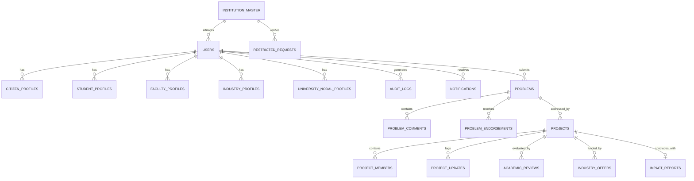

# SamadhanX (SIH 2026 — PS 26043) System Architecture & Technical Design

## 1. High-Level System Architecture

SamadhanX is engineered as a high-performance, modular, cloud-native architecture designed to bridge civic problem submitters, higher education institutions, faculty mentors, industry partners, and national administrators.

```
+---------------------------------------------------------------------------------------+
|                                    PRESENTATION TIER                                  |
|                                                                                       |
|   +-------------------------------------------------------------------------------+   |
|   |                  React 18 + TypeScript + Vite + Tailwind CSS                  |   |
|   |  - Role-Based Dynamic Dashboards (Citizen, Student, Faculty, Industry, Admin) |   |
|   |  - Real-Time Citizen Problem Timeline & Milestone Tracker                     |   |
|   |  - Zustand Global Auth & Profile State | TanStack Query Async State Cache     |   |
|   |  - Lucide React Iconography | Responsive Desktop/Mobile Viewports             |   |
|   +-------------------------------------------------------------------------------+   |
+------------------------------------------+--------------------------------------------+
                                           | HTTPS / JSON REST API (X-Request-ID, Bearer JWT)
                                           v
+---------------------------------------------------------------------------------------+
|                                   APPLICATION GATEWAY                                 |
|                                                                                       |
|   +-------------------------------------------------------------------------------+   |
|   |                         FastAPI Application Gateway                           |   |
|   |  - Lifespan State Manager | Security Headers Middleware (CSP, CORS, Referrer) |   |
|   |  - Correlation ID Middleware (X-Request-ID propagation to logs & errors)      |   |
|   |  - Multi-Tier RBAC & BOLA Authorization Guards (Strict Ownership Checks)      |   |
|   |  - Pydantic v2 Schema Validation | OpenAPI 3.1 & ReDoc Auto-Documentation     |   |
|   +-------------------------------------------------------------------------------+   |
+----------------------+------------------------------------+---------------------------+
                       |                                    |
                       v                                    v
+--------------------------------------+   +--------------------------------------------+
|             STORAGE TIER             |   |            ASYNC & WORKER TIER             |
|                                      |   |                                            |
|   +------------------------------+   |   |   +------------------------------------+   |
|   |   PostgreSQL 16 + pgvector   |   |   |   |          Redis 7 In-Memory         |   |
|   |  - SQLAlchemy 2.0 Async ORM  |   |   |   |  - Celery Message Broker & Backend |   |
|   |  - Alembic Schema Revision   |   |   |   |  - Rate-Limiting & Session Cache   |   |
|   |  - Relational Integrity      |   |   |   |  - OTP Anti-Brute-Force Tracker    |   |
|   |  - pgvector Cosine Distance  |   |   |   +-----------------+------------------+   |
|   |  - Tamper-Evident Audit Trail|   |   |                     |                      |
|   +------------------------------+   |   |                     v                      |
+--------------------------------------+   |   +------------------------------------+   |
                                           |   |           Celery Worker            |   |
                                           |   |  - Asynchronous Email Dispatch     |   |
                                           |   |  - AISHE Master Institution Sync   |   |
                                           |   |  - Automated Timeline Status Pushes|   |
                                           |   |  - Periodic Cleanup & Maintenance  |   |
                                           |   +------------------------------------+   |
                                           +--------------------------------------------+
```

---

## 2. Core Relational Data Model & Schemas

The database schema is managed through declarative SQLAlchemy 2.0 models and migrated via Alembic revisions.



### 2.1 Entity Descriptions

1. **`users`**: Central authentication identity with email, Argon2/bcrypt password hash, account role (`citizen`, `student`, `faculty`, `industry`, `university`, `admin`), verification status, and activity flags.
2. **`institution_master`**: Authoritative national registry of Indian universities and colleges containing AISHE code, institution name, category, state, and accreditation status.
3. **`restricted_account_requests`**: Onboarding requests for institutional and industry accounts requiring admin approval with official documentation and point-of-contact verification.
4. **`problems`**: Grassroots civic problem submissions with title, description, category, geographic tags, attachments, status (`SUBMITTED`, `VERIFIED`, `IN_PROGRESS`, `RESOLVED`, `REJECTED`), and author relation.
5. **`projects` (Innovation Pods)**: Student-led solutions addressing an approved civic problem with title, summary, stage (`draft`, `in_progress`, `review_pending`, `faculty_approved`, `pilot`, `completed`), team leader, and affiliated university.
6. **`project_members`**: Multi-disciplinary student pod roster linking teammates with defined roles (`lead`, `developer`, `researcher`, `designer`, `hardware_engineer`).
7. **`academic_reviews`**: Formal faculty mentorship evaluation records containing rubric scores, qualitative critique, review status (`approved`, `changes_requested`, `rejected`), and mentoring professor ID.
8. **`industry_offers`**: Corporate support proposals for vetted pods offering CSR grant funding, laboratory/equipment access, cloud credits, or pilot field testing.
9. **`impact_reports`**: Quantitative and qualitative post-deployment field impact records detailing citizen beneficiaries reached, metric improvements, validation photos, and field outcomes.
10. **`audit_logs`**: Immutable, append-only security logs capturing user action, entity type, target ID, IP address, and JSON metadata.

---

## 3. End-to-End Real-Time Lifecycle Flow

```
[1. Citizen Submits Problem]
            │
            ▼
[2. Admin Moderation & AI De-duplication]
            │ (Problem Status: VERIFIED)
            ▼
[3. Student Innovators Form Solution Pod]
            │ (Problem Status: IN_PROGRESS)
            ▼
[4. Pod Milestones & Engineering Logs]
            │ (Status: IN_PROGRESS)
            ▼
[5. Faculty Mentorship Adoption & Academic Review]
            │ (Pod Status: REVIEW_PENDING -> FACULTY_APPROVED)
            ▼
[6. Industry Partner CSR Funding & Pilot Sponsorship]
            │ (Pod Status: PILOT)
            ▼
[7. Field Deployment & Societal Impact Report]
            │ (Pod Status: COMPLETED -> Problem Status: RESOLVED)
            ▼
[8. Real-Time Citizen Resolution Notification]
```

---

## 4. Security & Authorization Architecture

### 4.1 Broken Object Level Authorization (BOLA) Defenses
Every data mutation and sensitive query validates resource ownership at the repository/service layer:
- **Citizen Timeline**: Citizen users can only access timeline history for problems they submitted (`problem.created_by == current_user.id`), with Admin bypass.
- **Student Pods**: Pod management (inviting members, submitting reviews) requires verified `pod.team_lead_id == current_user.id`.
- **Faculty Evaluation**: Faculty can only review pods belonging to their affiliated institution (`project.university_id == faculty.university_id`).
- **Industry Offer Access**: Unapproved industry accounts receive `403 ACCOUNT_PENDING_APPROVAL`. Detailed engineering logs are strictly gated to industry sponsors with accepted funding offers.

### 4.2 Security Headers & Cross-Origin Security
- **Content Security Policy (CSP)**: `default-src 'self'` with secure script/style whitelisting.
- **Frame Options**: `X-Frame-Options: DENY` to prevent clickjacking attacks.
- **MIME Sniffing**: `X-Content-Type-Options: nosniff`.
- **Referrer Policy**: `strict-origin-when-cross-origin`.
- **Correlation ID**: Every HTTP request receives an `X-Request-ID` attached to logs, audit events, and error responses.

---

## 5. Asynchronous Workers & AI Infrastructure

### 5.1 Celery + Redis Task Pipeline
- **Email Dispatching**: Async background delivery of OTP codes, account approval notifications, faculty invitations, and pod milestone alerts.
- **AISHE Master Sync**: Automated background ingestion and periodic synchronisation of national university databases.
- **Real-Time Stage Propagation**: Background event emission when pod status changes trigger automated stage notifications to the original problem submitter.

### 5.2 pgvector Semantic Engine
- High-dimensional vector embeddings stored directly in PostgreSQL via the `pgvector` extension.
- Cosine distance and Euclidean similarity operators index civic problems for instant duplicate detection and AI-assisted pod recommendation.
